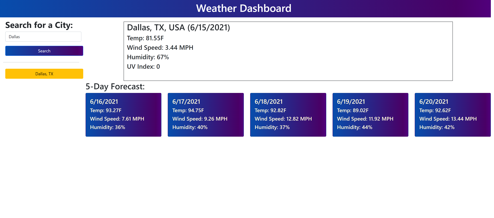

# WeatherDashboard
INTRODUCTION
------------

Uses openweather API to display weather data about a given location. Dynamically updates HTML and CSS given user inputs.

------------

Finished product:

Link to final page:
https://jamesj995.github.io/WeatherDashboard/

MAINTAINERS
-----------

Current maintainers:
 * James Johnson (https://github.com/JamesJ995)

